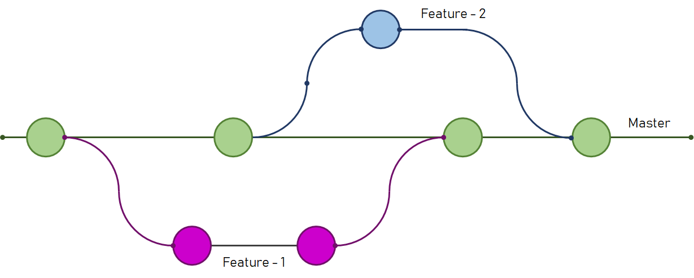
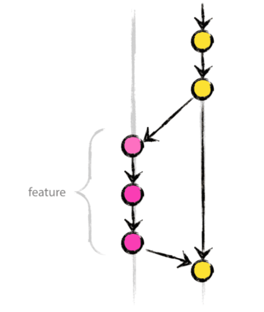
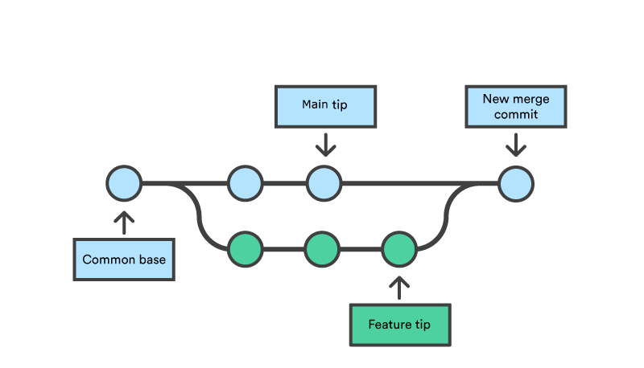

---

title: Part 4 - Branches (Parallel Universes)
theme: simple
highlightTheme: github
---


# Part 4 – Branches
## Parallel Universes in Git

---


## Why do branches exist?




---

## Real-life example

- `main` → the version that works
- `login-page` → you are building the login system
- `dark-mode` → your friend is adding dark theme
- `bugfix-typo` → someone is fixing small typos

Everyone works at the same time → no problem!

---

## Visualising branches

```bash
git branch          # shows you this:
  dark-mode
  login-page
* main              # ← the star = where you are right now
```

The star moves when you change branch.

---

## Basic branch commands 

```bash
# 1. Create + switch in one command (most common)
git switch -c new-feature

# 2. Just switch to an existing branch
git switch main
git switch login-page

# 3. List all branches
git branch --all
```


---

## The safe workflow 

```bash
git switch -c my-cool-feature   # create branch + jump there
# → code code code
git add .
git commit -m "finished something"
git switch main                 # go back to main
git merge my-cool-feature       # bring the work into main
```

---

## Merging = bringing work together

Two possible outcomes:

### 1. Fast-forward (perfect world)

### 2. Merge conflict 

---

## Fast-forward merge (most of the time)




---

## When a conflict happens

Both branches changed the **same lines** in the **same file**.

Git can't decide what to keep/what to remove by itself
```
CONFLICT (content): Merge conflict in scrabble_score.py
Automatic merge failed; fix conflicts and then commit the result.
```

---

### How to fix a conflict

1. Open the file → you see this:
```python
<<<<<<< HEAD
# code from main
=======
# code from the feature branch
>>>>>>> my-cool-feature
```

2. Edit the file → keep what you want (usually both parts)
   Delete the `<<<<<<<`, `=======`, `>>>>>>>` lines

3. Save → then tell Git you’re done:
```bash
git add scrabble_score.py
git commit -m "Merged feature with small fix"
```
---



---

## Golden rule

**Never work directly on main for new stuff**  
Always create a branch 

```bash
# Good
git switch -c login-page

# Dangerous (don’t do this for big changes)
# working directly on main
```

---

## Quick cheat-sheet

```bash
git switch -c name        # new branch + jump
git switch name           # change branch
git branch                # see branches
git merge name            # bring branch into current one
```

---

## Recap – The complete safe workflow

```bash
git switch main
git switch -c cool-new-thing
# code code code
git add . && git commit -m "…"
git switch main
git merge cool-new-thing
git push                  # send everything to GitLab
```

---

## Now go do the Scrabble exercise!
https://gitlab.unistra.fr/cours_git/exercise_scrabble

You'll have to combine 2 new branches to main:
- `main`
- `letter-multi` 
- `word-multiplier` 

---

## Then move to the last git exercises
https://github.com/KnuxV/nlp-steamlit-app